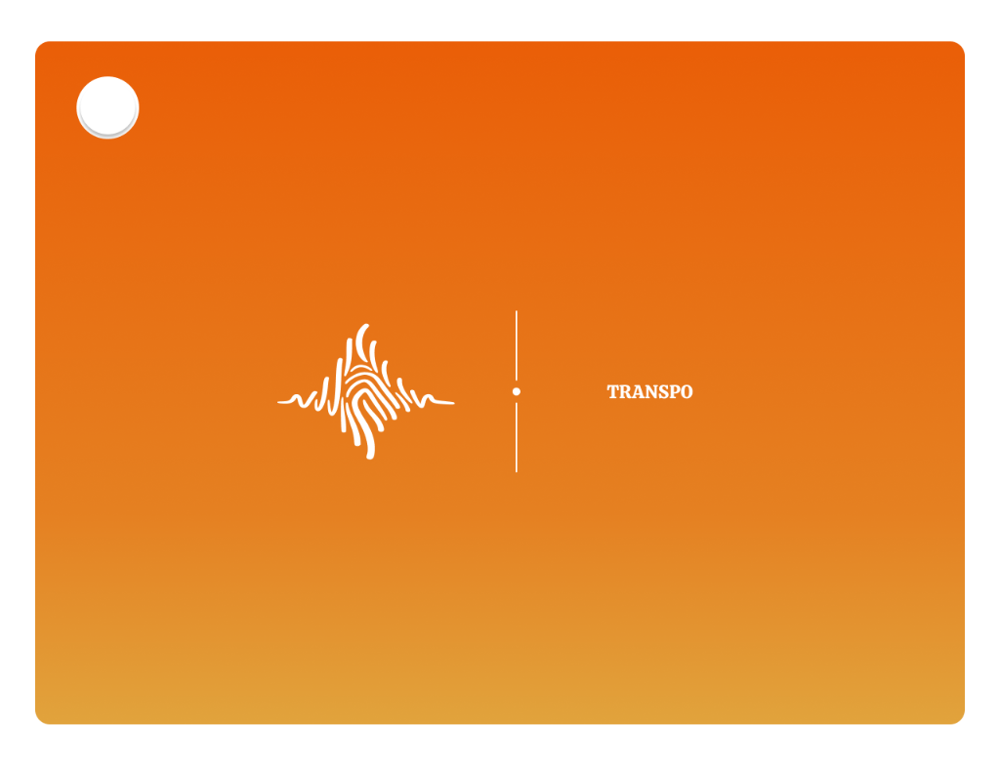

# Transpo Landing Page



Transpo is a high-performance, single-page landing site designed for a next-generation adaptive audio tool. This project features a premium design system, fluid motion graphics, and a seamless transition from a splash screen to the hero experience.

## 🚀 Key Features

- **Splash-to-Hero Orchestration**: A custom Apple-inspired startup animation that transitions from a centered rectangular logo into the hero background.
- **Dynamic Browser Mockup**: A high-fidelity, interactive UI mimicking a Chrome extension within a browser (YouTube) environment.
- **ScrollSpy Indicator**: A stationary vertical section indicator that updates as the user scrolls through the products, support, feedback, and sign-up sections.
- **Sanity.io Integration**: 
  - Self-hosted Sanity Studio at `/admin`.
  - Secure form submissions for user feedback and early access signups.
- **Premium Design System**: Built with **Calistoga** and **Inter** type pairing, featuring a Burnt Orange gradient theme and glassmorphic components.
- **Responsive Navigation**: A symmetric pill-shaped sticky navbar with a responsive mobile-first dropdown menu.

## 🛠 Tech Stack

- **Framework**: [Next.js](https://nextjs.org/) (App Router)
- **Styling**: [Tailwind CSS v4](https://tailwindcss.com/)
- **Animation**: [Framer Motion](https://www.framer.com/motion/)
- **CMS**: [Sanity.io](https://www.sanity.io/)
- **Icons**: [Lucide React](https://lucide.dev/)
- **Typography**: [Google Fonts](https://fonts.google.com/) (Next/font)

## 🏁 Getting Started

### Prerequisites

- Node.js 18+
- A Sanity.io account (for form submissions)

### Installation

1.  Clone the repository:
    ```bash
    git clone https://github.com/transpo-org/transpo-landing.git
    cd transpo-landing
    ```

2.  Install dependencies:
    ```bash
    npm install
    ```

3.  Configure environment variables:
    Create a `.env.local` file with your Sanity credentials:
    ```env
    NEXT_PUBLIC_SANITY_PROJECT_ID=your_project_id
    NEXT_PUBLIC_SANITY_DATASET=production
    SANITY_API_WRITE_TOKEN=your_api_write_token
    ```

4.  Start the development server:
    ```bash
    npm run dev
    ```

## 🏗 Project Structure

- `src/app`: App Router pages and API handlers.
- `src/components/animations`: Complex motion orchestrations (Splash, Background).
- `src/components/layout`: Core layout components (Navbar, Footer, ScrollSpy).
- `src/components/sections`: Landing page sections (Hero, Products, Support).
- `src/components/forms`: Interactive Sanity-linked forms.
- `src/sanity`: Schema definitions and client configuration.

---

For more detailed technical info, see [ARCHITECTURE.md](./ARCHITECTURE.md).
